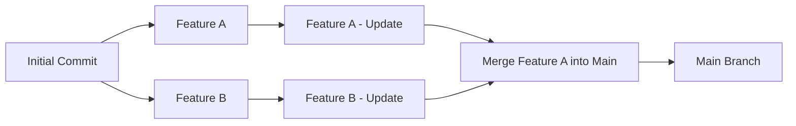

# Version Control and Collaboration

- [Version Control and Collaboration](#version-control-and-collaboration)
  - [Version Control](#version-control)
    - [Core Git Concepts](#core-git-concepts)
    - [Essential Git Commands](#essential-git-commands)
  - [Common Git Usage Scenarios](#common-git-usage-scenarios)
    - [Git Setup](#git-setup)
    - [Repository Creation](#repository-creation)
    - [Implementing New Features](#implementing-new-features)
    - [Conflict Resolution](#conflict-resolution)
    - [Viewing Change History](#viewing-change-history)
    - [Undoing Changes](#undoing-changes)
    - [Repository Configuration](#repository-configuration)
    - [Rebasing](#rebasing)
    - [Stashing (Saving Temporary Changes)](#stashing-saving-temporary-changes)
  - [Code Review Processes](#code-review-processes)
  - [Using Git for Automation Scripts](#using-git-for-automation-scripts)
    - [Performance and Optimization](#performance-and-optimization)
  - [Bibliography](#bibliography)

## Version Control

**Version control** is a system for managing changes in files, providing effective coordination of work between project participants. Git is the de facto standard among distributed version control systems due to its reliability and performance. Modern development platforms — GitHub, GitLab, Bitbucket — extend Git's functionality by providing cloud infrastructure for repository hosting and comprehensive tools for team development.

The Git system was created in 2005 as a solution for managing Linux kernel development, which required high performance and reliability. Over the years, Git has evolved into a universal tool that has become an industry standard thanks to its **distributed architecture**, **high performance**, and **flexible branching capabilities**, allowing efficient management of projects of any scale.

The modern development environments (IDEs) integrate Git support, providing developers with convenient graphical interfaces. Additionally, there are specialized GUI clients for Git, such as Sourcetree, GitKraken, and others, which facilitate working with the version control system, especially for users who prefer visual tools over the command line.

### Core Git Concepts

Effective work with Git requires understanding key concepts that form the foundation of the version control system:

**Core Structural Elements:**

- **Repository**: Centralized storage of a project, including all files, metadata, and complete change history
- **Commit**: Atomic snapshot of project state with unique cryptographic identifier (SHA-1 hash)
- **Branch**: Independent development line allowing parallel work on different features

**Collaborative Operations:**

- **Remote Repository**: Centralized storage on a server for synchronization between participants
- **Clone**: Creating a complete local copy of a remote repository
- **Pull**: Synchronizing local repository with remote changes
- **Push**: Publishing local changes to remote repository

**Change Management:**

- **Merge**: Integration of changes from different branches while preserving history
- **Conflict**: Ambiguous situation during automatic merging that requires manual resolution

**Git Architecture** is based on the concept of a Directed Acyclic Graph (DAG), where each commit represents an immutable snapshot of the project state. Commits are linked by parent references, forming a chain of change history.

**Branching** allows creating parallel development lines without affecting the main codebase. Each branch represents a lightweight pointer to a specific commit, enabling efficient creation and switching between different development contexts.

**Branch merging** integrates changes from different branches, preserving complete development history and ensuring transparency of the development process.



Thus, commits form a directed acyclic graph (DAG), where each commit references its parent, and branches represent separate paths in this graph. This allows free movement through change history, creating new branches for experiments, and easy integration of changes.

### Essential Git Commands

**Initialization and Configuration:**

- `git init` — Initialize new local repository
- `git clone <url>` — Clone remote repository
- `git config` — Configure Git parameters

**Change Management:**

- `git status` — Analyze current working directory state
- `git add <file>` — Prepare files for commit (staging)
- `git commit -m "message"` — Record changes with descriptive message
- `git log` — View commit history with detailed information

**Branch Operations:**

- `git branch` — Branch management (view, create, delete)
- `git switch <branch>` — Switch between branches (modern approach, recommended with Git 2.23+)
- `git checkout <branch>` — Switch between branches (classic approach, universal command)
- `git merge <branch>` — Integrate changes from specified branch

**Remote Repository Synchronization:**

- `git remote` — Manage remote repositories
- `git fetch` — Get updates without automatic merging
- `git pull` — Get and automatically integrate changes
- `git push` — Publish local changes to remote repository

## Common Git Usage Scenarios

### Git Setup

**Initial Git configuration** is a mandatory step ensuring correct identification of change authors. Configuration includes specifying username and email address that will be associated with each commit:

```bash
git config --global user.name "User Name"
git config --global user.email "email@example.com"
```

### Repository Creation

Creating a new Git repository includes:

- Initializing a new repository;
- Creating the base branch;
- Linking with remote repository.

To create a new project `my_project` with main branch `main` and link it with a remote repository, you can execute the following commands:

```bash
# Create new repository
git init my_project
cd my_project
# Create main branch
git checkout -b main
# Create first file (e.g., README.md)
echo "# My Project" > README.md
# First commit
git add .
git commit -m "Initial commit"
# Link with remote repository
git remote add origin <url>
# Push changes to remote repository
git push -u origin main
```

### Implementing New Features

Standard Git practice involves protecting the base branch (e.g., `main`) from direct changes. For implementing new functionality, it's recommended to create separate branches where all changes will be made. After completing work on the feature, changes can be merged into the main branch through a pull request.

```bash
# Switch to main branch and get latest changes
git checkout main
git pull origin main
# Create new branch for feature
git checkout -b feature-branch
# or modern way:
# git switch -c feature-branch
# Make changes and create commits
git add .
git commit -m "Add new feature"
# Push changes to remote repository
git push origin feature-branch
```

After this, you can create a pull request in the platform interface (GitHub, GitLab, etc.) for discussion and review of changes.

### Conflict Resolution

**Merge conflicts** occur when attempting automatic integration of changes affecting identical code sections in different branches. This is a natural situation in collaborative development when multiple developers independently modify the same parts of files.

When a conflict is detected, Git pauses the merge process and marks problematic files with special markers indicating conflicting fragments. **Conflict resolution** requires manual analysis and decisions about which changes to keep, combine, or modify.

```bash
# Attempt to merge branches
git checkout main
git merge feature-branch
# If conflicts occur, Git will report this
# View conflicting files
git status
# Open conflicting files and manually resolve conflicts
# (remove markers <<<<<<< ======= >>>>>>> and choose needed code)
# After resolving conflicts, add files to index
git add <conflicted-file>
# Complete merge
git commit -m "Resolve merge conflicts between main and feature-branch"
# Push changes to remote repository
git push origin main
```

### Viewing Change History

To view change history in the repository, you can use the `git log` command, which displays a list of all commits in the current branch:

```bash
git log
```

You can use various options for formatting output, for example:

```bash
git log --oneline
```

You can notice that each commit has a unique identifier (hash), author, date, and commit message.

You can also view changes in a specific file using the `git diff` command:

```bash
git diff <file>
```

### Undoing Changes

Sometimes it may be necessary to undo changes made in the repository. If changes haven't been committed yet (no commits created), you can use the `git restore` command:

```bash
# Undo changes in working directory (modern approach)
git restore <file>
# Undo changes in index (staging area)
git restore --staged <file>
```

If changes have already been committed, you can use the `git revert` command to create a new commit that undoes changes from the previous commit:

```bash
# Revert last commit
git revert HEAD
```

You can also use `git reset` to move the branch pointer to a previous commit, but this can lead to **irreversible data loss**, so use this command extremely carefully:

```bash
# CAUTION: Move branch pointer to previous commit
# This will delete all uncommitted changes!
git reset --hard HEAD~1

# Safer alternative - preserve changes:
git reset --soft HEAD~1  # Preserves changes in staging area
git reset --mixed HEAD~1 # Preserves changes in working directory
```

### Repository Configuration

Repository configuration includes creating and setting up various files that define Git behavior and ensure convenient project work. The `.gitignore` file is a critically important configuration element defining files and directories to exclude from tracking. The following example demonstrates typical `.gitignore` content adapted for various programming languages and development environments:

```gitignore
# Compiled files
*.class          # Java
*.o              # C/C++
*.pyc            # Python
__pycache__/     # Python cache

# Build files and dependencies
build/           # General build files
dist/            # Distributions
target/          # Maven/Java
node_modules/    # Node.js

# Confidential data
.env             # Environment variables
*.key            # Private keys
*.pem            # Certificates
config/secrets/  # Configuration secrets

# IDEs and editors
.vscode/         # Visual Studio Code
.idea/           # IntelliJ IDEA
*.swp            # Vim swap files
*.swo            # Vim temp files

# Logs and temporary files
*.log            # Log files
*.tmp            # Temporary files
*.temp           # Temporary files
.DS_Store        # macOS system files
Thumbs.db        # Windows thumbnail cache
```

Additionally, other configuration files can be created for convenient project work:

- **.gitattributes**: Defines file attributes (line ending handling, encoding, merge strategies);
- **README.md**: Project description, installation and usage instructions;
- **LICENSE**: Code usage license.

### Rebasing

Rebase allows rewriting commit history, creating a more linear and clean history. Having linear history simplifies understanding the sequence of changes and facilitates navigation through project history. However, rebase should be used carefully, especially when working with shared branches, to avoid conflicts and data loss.

```bash
# Rebase current branch onto main
git rebase main

# Interactive rebase for editing commits
git rebase -i HEAD~3
```

### Stashing (Saving Temporary Changes)

Stash allows temporarily saving unfinished changes:

```bash
# Save current changes
git stash

# View stash list
git stash list

# Restore saved changes
git stash pop
```

## Code Review Processes

**Code Review** is a systematic process of checking code changes by other developers before their integration into the main branch. This process is a critically important element of software quality assurance, contributing to:

- **Code quality improvement** through identification of potential errors and vulnerabilities
- **Knowledge sharing** between team members
- **Adherence to coding standards** and architectural principles
- **Collective responsibility** for product quality

A typical development process using code review includes the following stages:

1. **Planning**: Task definition and feature branch creation
2. **Development**: Feature implementation with regular commits
3. **Preliminary testing**: Local functionality verification
4. **Publishing**: Pushing branch to remote repository
5. **Pull Request**: Creating merge request with change description
6. **Automated checks**: CI/CD pipeline, static analysis
7. **Manual review**: Code, architecture review, discussion
8. **Iterations**: Addressing feedback and re-review
9. **Approval and merge**: Integration into main branch

The code review process can be supported by various tools integrated into development platforms (GitHub, GitLab, Bitbucket) or specialized systems (Crucible, Review Board). These tools provide convenient interfaces for discussing changes, tracking comments, and managing the review process.

## Using Git for Automation Scripts

Git as the foundation of DevOps processes plays a central role in modern software development automation. The version control system serves not only as a code management tool but also as a **trigger mechanism** for launching automated processes.

Integration with CI/CD systems allows creating complex automation pipelines:

- **Continuous Integration**: Automatic building, testing, and static analysis with each commit
- **Automated Deployment**: Deployment to various environments based on repository events
- **Release Management**: Automatic release creation, version tagging, and documentation generation
- **Quality Monitoring**: Integration with code analysis systems and metrics tracking

**Git events** (commits, pull requests, tags) serve as **integration points** for launching automated workflows, providing seamless connection between development and operational processes.

### Performance and Optimization

**Optimization for large repositories:**

- **Git LFS (Large File Storage)**: Handling large files (media, binary files)
- **Partial Clone**: Cloning only necessary repository parts
- **Shallow Clone**: Limited history depth for fast cloning

```bash
# Shallow clone with limited history
git clone --depth 1 <repository-url>

# Partial clone without large files
git clone --filter=blob:limit=1m <repository-url>
```

**Performance monitoring:**

```bash
# Repository statistics
git count-objects -vH

# File size analysis
git ls-tree -r -t -l --abbrev HEAD | sort -n -k 4

# Repository optimization
git gc --aggressive --prune=now
```

## Bibliography

1. [Chacon Scott, Straub Ben, Pro Git Book, Apress, 2nd Edition, 2014](https://git-scm.com/book/en/v2)
2. [Git Documentation, GIT](https://git-scm.com/doc)
3. [Braganza Adrienne, Looks good to me!, Manning, 2024](https://www.manning.com/books/looks-good-to-me)
