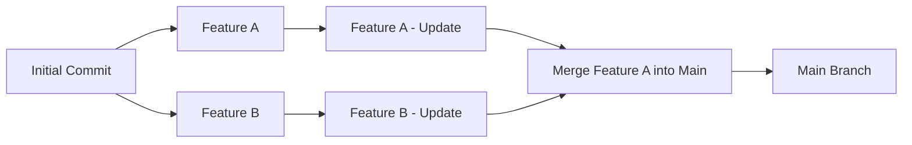

# Контроль версий и сотрудничество

- [Контроль версий и сотрудничество](#контроль-версий-и-сотрудничество)
  - [Контроль версий](#контроль-версий)
    - [Основные концепции Git](#основные-концепции-git)
    - [Основные команды Git](#основные-команды-git)
  - [Типичные сценарии использования Git](#типичные-сценарии-использования-git)
    - [Настройка Git](#настройка-git)
    - [Создание репозитория](#создание-репозитория)
    - [Реализация нового функционала](#реализация-нового-функционала)
    - [Разрешение конфликтов](#разрешение-конфликтов)
    - [Просмотр истории изменений](#просмотр-истории-изменений)
    - [Отмена изменений](#отмена-изменений)
    - [Конфигурация репозитория](#конфигурация-репозитория)
    - [Rebasing (Перебазирование)](#rebasing-перебазирование)
    - [Stashing (Сохранение временных изменений)](#stashing-сохранение-временных-изменений)
  - [Процессы ревью кода](#процессы-ревью-кода)
  - [Использование Git для автоматизации сценариев](#использование-git-для-автоматизации-сценариев)
    - [Производительность и оптимизация](#производительность-и-оптимизация)
  - [Библиография](#библиография)

## Контроль версий

**Контроль версий** представляет собой систему управления изменениями в файлах, обеспечивающую эффективную координацию работы между участниками проекта. Git является де-факто стандартом среди распределенных систем контроля версий благодаря своей надежности и производительности. Современные платформы разработки — GitHub, GitLab, Bitbucket — расширяют функциональность Git, предоставляя облачную инфраструктуру для хостинга репозиториев и комплексные инструменты для командной разработки.

Система Git была создана в 2005 году как решение для управления разработкой ядра Linux, требующего высокой производительности и надежности. За прошедшие годы Git эволюционировал в универсальный инструмент, ставший индустриальным стандартом благодаря своей **распределенной архитектуре**, **высокой производительности** и **гибким возможностям ветвления**, позволяющим эффективно управлять проектами любого масштаба.

Современные системы разработки (IDE) интегрируют поддержку Git, предоставляя разработчикам удобные графические интерфейсы. Кроме того, существуют специализированные GUI-клиенты для Git, такие как Sourcetree, GitKraken и другие, которые облегчают работу с системой контроля версий, особенно для пользователей, предпочитающих визуальные инструменты командной строке.

### Основные концепции Git

Эффективная работа с Git требует понимания ключевых концепций, составляющих основу системы контроля версий:

**Основные структурные элементы:**

- **Репозиторий (Repository)**: Централизованное хранилище проекта, включающее все файлы, метаданные и полную историю изменений
- **Коммит (Commit)**: Атомарный снимок состояния проекта с уникальным криптографическим идентификатором (SHA-1 хеш)
- **Ветка (Branch)**: Независимая линия разработки, позволяющая параллельную работу над различными функциями

**Операции совместной работы:**

- **Удаленный репозиторий (Remote Repository)**: Централизованное хранилище на сервере для синхронизации между участниками
- **Клонирование (Clone)**: Создание полной локальной копии удаленного репозитория
- **Получение (Pull)**: Синхронизация локального репозитория с удаленными изменениями
- **Отправка (Push)**: Публикация локальных изменений в удаленный репозиторий

**Управление изменениями:**

- **Слияние (Merge)**: Интеграция изменений из различных веток с сохранением истории
- **Конфликт (Conflict)**: Ситуация неоднозначности при автоматическом слиянии, требующая ручного разрешения

**Архитектура Git** основана на концепции направленного ациклического графа (DAG), где каждый коммит представляет собой неизменяемый снимок состояния проекта. Коммиты связаны родительскими ссылками, формируя цепочку истории изменений.

**Ветвление** позволяет создавать параллельные линии разработки без влияния на основную кодовую базу. Каждая ветка представляет собой легковесный указатель на определенный коммит, что обеспечивает эффективное создание и переключение между различными контекстами разработки.

**Слияние веток** интегрирует изменения из разных веток, сохраняя полную историю разработки и обеспечивая прозрачность процесса разработки.



Таким образом, коммиты образуют направленный ацикличный граф (DAG), где каждый коммит ссылается на своего родителя, а ветки представляют собой отдельные пути в этом графе. Это позволяет свободно двигаться по истории изменений, создавать новые ветки для экспериментов и легко интегрировать изменения.

### Основные команды Git

**Инициализация и настройка:**

- `git init` — Инициализация нового локального репозитория
- `git clone <url>` — Клонирование удаленного репозитория
- `git config` — Конфигурирование параметров Git

**Управление изменениями:**

- `git status` — Анализ текущего состояния рабочего каталога
- `git add <file>` — Подготовка файлов к коммиту (staging)
- `git commit -m "message"` — Фиксация изменений с описательным сообщением
- `git log` — Просмотр истории коммитов с детальной информацией

**Работа с ветками:**

- `git branch` — Управление ветками (просмотр, создание, удаление)
- `git switch <branch>` — Переключение между ветками (современный подход, рекомендуется с Git 2.23+)
- `git checkout <branch>` — Переключение между ветками (классический подход, универсальная команда)
- `git merge <branch>` — Интеграция изменений из указанной ветки

**Синхронизация с удаленными репозиториями:**

- `git remote` — Управление удаленными репозиториями
- `git fetch` — Получение обновлений без автоматического слияния
- `git pull` — Получение и автоматическая интеграция изменений
- `git push` — Публикация локальных изменений в удаленный репозиторий

## Типичные сценарии использования Git

### Настройка Git

**Первоначальная конфигурация Git** является обязательным этапом, обеспечивающим корректную идентификацию автора изменений. Настройка включает указание имени пользователя и адреса электронной почты, которые будут ассоциированы с каждым коммитом:

```bash
git config --global user.name "Имя Пользователя"
git config --global user.email "email@example.com"
```

### Создание репозитория

Создание нового репозитория Git включает в себя:

- Инициализацию нового репозитория;
- Создание базовой ветки;
- Связывание с удаленным репозиторием.

Для создания нового проекта `my_project` с главной веткой `main` и связывания его с удаленным репозиторием можно выполнить следующие команды:

```bash
# Создание нового репозитория
git init my_project
cd my_project
# Создание главной ветки
git checkout -b main
# Создание первого файла (например, README.md)
echo "# My Project" > README.md
# Первый коммит
git add .
git commit -m "Initial commit"
# Связывание с удаленным репозиторием
git remote add origin <url>
# Отправка изменений в удаленный репозиторий
git push -u origin main
```

### Реализация нового функционала

Стандартной практикой работы с Git является защита базовой ветки (например, `main`) от прямых изменений. Для реализации нового функционала рекомендуется создавать отдельные ветки, в которых будут вестись все изменения. После завершения работы над функционалом, изменения можно будет слить в основную ветку через запрос на слияние (pull request).

```bash
# Переключение на основную ветку и получение последних изменений
git checkout main
git pull origin main
# Создание новой ветки для функционала
git checkout -b feature-branch
# или современный способ:
# git switch -c feature-branch
# Внесение изменений и создание коммитов
git add .
git commit -m "Add new feature"
# Отправка изменений в удаленный репозиторий
git push origin feature-branch
```

После этого можно создать запрос на слияние (pull request) в интерфейсе платформы (GitHub, GitLab и т.д.) для обсуждения и проверки изменений.

### Разрешение конфликтов

**Конфликты слияния** возникают при попытке автоматического объединения изменений, затрагивающих идентичные участки кода в различных ветках. Это естественная ситуация в процессе совместной разработки, когда несколько разработчиков независимо модифицируют одни и те же части файлов.

При обнаружении конфликта Git приостанавливает процесс слияния и помечает проблемные файлы специальными маркерами, указывающими на конфликтующие фрагменты. **Разрешение конфликтов** требует ручного анализа и принятия решений о том, какие изменения следует сохранить, объединить или модифицировать.

```bash
# Попытка слияния веток
git checkout main
git merge feature-branch
# Если возникают конфликты, Git сообщит об этом
# Просмотр конфликтующих файлов
git status
# Открытие конфликтующих файлов и ручное разрешение конфликтов
# (удаление маркеров <<<<<<< ======= >>>>>>> и выбор нужного кода)
# После разрешения конфликтов, добавление файлов в индекс
git add <conflicted-file>
# Завершение слияния
git commit -m "Resolve merge conflicts between main and feature-branch"
# Отправка изменений в удаленный репозиторий
git push origin main
```

### Просмотр истории изменений

Для просмотра истории изменений в репозитории можно использовать команду `git log`, которая отображает список всех коммитов в текущей ветке:

```bash
git log
```

Можно использовать различные опции для форматирования вывода, например:

```bash
git log --oneline
```

Можно заметить, что каждый коммит имеет уникальный идентификатор (хеш), автора, дату и сообщение коммита.

Также можно просматривать изменения в конкретном файле с помощью команды `git diff`:

```bash
git diff <file>
```

### Отмена изменений

Иногда может возникнуть необходимость отменить изменения, сделанные в репозитории. В случае, если изменения еще не были зафиксированы (не созданы коммиты), можно использовать команду `git checkout` для возврата к последнему коммиту:

```bash
# Отмена изменений в рабочем каталоге (современный подход)
git restore <file>
# Отмена изменений в индексе (staging area)
git restore --staged <file>
# Устаревший способ (для совместимости со старыми версиями Git):
# git checkout -- <file>
```

Если изменения уже были зафиксированы, можно использовать команду `git revert` для создания нового коммита, который отменяет изменения предыдущего коммита:

```bash
# Отмена последнего коммита
git revert HEAD
```

Можно также использовать `git reset` для перемещения указателя ветки на предыдущий коммит, но это может привести к **безвозвратной потере данных**, поэтому используйте эту команду крайне осторожно:

```bash
# ОСТОРОЖНО: Перемещение указателя ветки на предыдущий коммит
# Это удалит все незафиксированные изменения!
git reset --hard HEAD~1

# Более безопасная альтернатива - сохранить изменения:
git reset --soft HEAD~1  # Сохраняет изменения в staging area
git reset --mixed HEAD~1 # Сохраняет изменения в рабочей директории
```

### Конфигурация репозитория

Конфигурация репозитория включает в себя создание и настройку различных файлов, которые определяют поведение Git и обеспечивают удобство работы с проектом. Файл `.gitignore` является критически важным элементом конфигурации, определяющим файлы и каталоги, которые следует исключить из отслеживания. Следующий пример демонстрирует типичное содержимое файла `.gitignore`, адаптированного для различных языков программирования и сред разработки:

```gitignore
# Компилированные файлы
*.class          # Java
*.o              # C/C++
*.pyc            # Python
__pycache__/     # Python cache

# Файлы сборки и зависимости
build/           # Общие файлы сборки
dist/            # Дистрибутивы
target/          # Maven/Java
node_modules/    # Node.js

# Конфиденциальные данные
.env             # Переменные окружения
*.key            # Приватные ключи
*.pem            # Сертификаты
config/secrets/  # Конфигурационные секреты

# IDE и редакторы
.vscode/         # Visual Studio Code
.idea/           # IntelliJ IDEA
*.swp            # Vim swap files
*.swo            # Vim temp files

# Логи и временные файлы
*.log            # Лог файлы
*.tmp            # Временные файлы
*.temp           # Временные файлы
.DS_Store        # macOS system files
Thumbs.db        # Windows thumbnail cache
```

Кроме того, для удобства работы с проектом могут быть созданы и другие файлы конфигурации:

- **.gitattributes**: Определяет атрибуты файлов (обработка концов строк, кодировка, merge стратегии);
- **README.md**: Описание проекта, инструкции по установке и использованию;
- **LICENSE**: Лицензия на использование кода.

### Rebasing (Перебазирование)

Rebase позволяет переписать историю коммитов, создавая более линейную и чистую историю. Наличие линейной истории упрощает понимание последовательности изменений и облегчает навигацию по истории проекта. Однако следует использовать rebase с осторожностью, особенно при работе с общими ветками, чтобы избежать конфликтов и потери данных.

```bash
# Перебазирование текущей ветки на main
git rebase main

# Интерактивное перебазирование для редактирования коммитов
git rebase -i HEAD~3
```

### Stashing (Сохранение временных изменений)

Stash позволяет временно сохранить незавершенные изменения:

```bash
# Сохранить текущие изменения
git stash

# Просмотр списка stash
git stash list

# Восстановление сохранённых изменений
git stash pop
```

## Процессы ревью кода

**Ревью кода (Code Review)** представляет собой систематический процесс проверки изменений в коде другими разработчиками до их интеграции в основную ветку. Этот процесс является критически важным элементом обеспечения качества программного обеспечения, способствующим:

- **Повышению качества кода** через выявление потенциальных ошибок и уязвимостей
- **Обмену знаниями** между членами команды
- **Соблюдению стандартов кодирования** и архитектурных принципов
- **Коллективной ответственности** за качество продукта

Типичный процесс разработки с использованием ревью кода включает следующие этапы:

1. **Планирование**: Определение задачи и создание фича-ветки
2. **Разработка**: Реализация функциональности с регулярными коммитами
3. **Предварительное тестирование**: Локальная проверка функциональности
4. **Публикация**: Отправка ветки в удалённый репозиторий
5. **Pull Request**: Создание запроса на слияние с описанием изменений
6. **Автоматические проверки**: CI/CD пайплайн, статический анализ
7. **Мануальное ревью**: Проверка кода, архитектуры, обсуждение
8. **Итерации**: Исправление замечаний и повторное ревью
9. **Одобрение и слияние**: Интеграция в основную ветку

## Использование Git для автоматизации сценариев

Git как основа DevOps-процессов играет центральную роль в современной автоматизации разработки программного обеспечения. Система контроля версий служит не только инструментом управления кодом, но и **триггерным механизмом** для запуска автоматизированных процессов.

Интеграция с CI/CD системами позволяет создавать сложные пайплайны автоматизации:

- **Непрерывная интеграция**: Автоматическая сборка, тестирование и статический анализ при каждом коммите
- **Автоматизированное развертывание**: Развертывание в различные среды на основе событий в репозитории
- **Управление релизами**: Автоматическое создание релизов, тегирование версий и генерация документации
- **Мониторинг качества**: Интеграция с системами анализа кода и отслеживания метрик

**События Git** (коммиты, pull requests, теги) служат **точками интеграции** для запуска автоматизированных workflows, обеспечивая бесшовную связь между разработкой и операционными процессами.

### Производительность и оптимизация

**Оптимизация работы с большими репозиториями:**

- **Git LFS (Large File Storage)**: Обработка больших файлов (медиа, бинарные файлы)
- **Partial Clone**: Клонирование только необходимых частей репозитория
- **Shallow Clone**: Ограниченная глубина истории для быстрого клонирования

```bash
# Shallow clone с ограниченной историей
git clone --depth 1 <repository-url>

# Partial clone без больших файлов
git clone --filter=blob:limit=1m <repository-url>
```

**Мониторинг производительности:**

```bash
# Статистика репозитория
git count-objects -vH

# Анализ размера файлов
git ls-tree -r -t -l --abbrev HEAD | sort -n -k 4

# Оптимизация репозитория
git gc --aggressive --prune=now
```

## Библиография

1. [Chacon Scott, Straub Ben, Pro Git Book, Apress, 2nd Edition, 2014](https://git-scm.com/book/en/v2)
2. [Git Documentation, GIT](https://git-scm.com/doc)
3. [Braganza Adrienne, Looks good for me!, Manning, 2024](https://www.manning.com/books/looks-good-to-me)