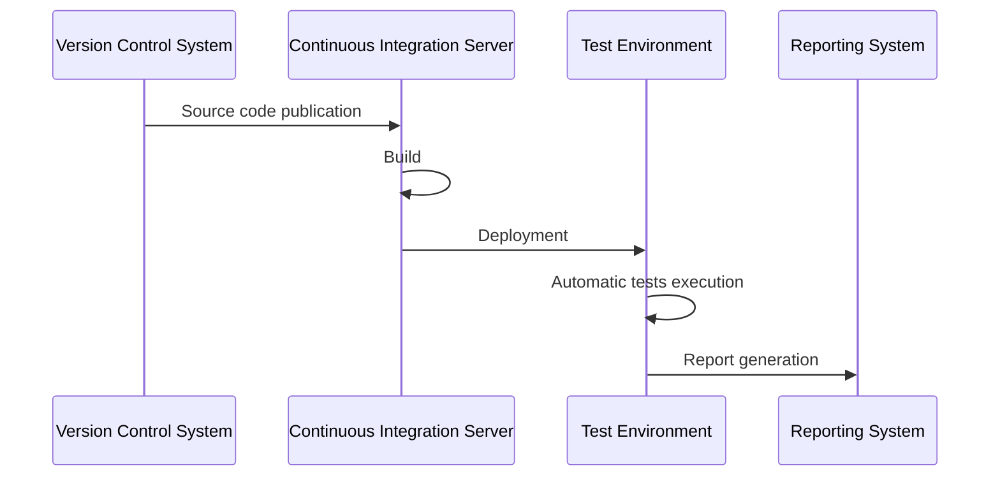

# CI/CD Pipelines

- [CI/CD Pipelines](#cicd-pipelines)
  - [Continuous Integration](#continuous-integration)
  - [Continuous Delivery and Deployment](#continuous-delivery-and-deployment)
  - [CI/CD Processes](#cicd-processes)
    - [Key DevOps Practices in CI/CD](#key-devops-practices-in-cicd)
  - [Tools and Technologies](#tools-and-technologies)
    - [GitHub Actions](#github-actions)
    - [GitLab CI](#gitlab-ci)
    - [Jenkins](#jenkins)
  - [Bibliography](#bibliography)

Modern software development resembles assembly line production. Each stage of software creation requires automation and integration into a unified process. Specialized technologies are used to solve these tasks: _Continuous Integration_ (CI) and _Continuous Delivery/Deployment_ (CD).

## Continuous Integration

As already mentioned in the [version control chapter](04_git.en.md), a typical developer workflow includes the following steps:

1. **Planning**: Defining the task and creating a feature branch;
2. **Development**: Implementing functionality with regular commits;
3. **Preliminary testing**: Local functionality verification;
4. **Publication**: Pushing the branch to a remote repository;
5. **Pull Request**: Creating a merge request with change descriptions;
6. **Automatic checks**: CI/CD pipeline, static analysis;
7. **Manual review**: Code review, architecture discussion;
8. **Iterations**: Fixing comments and re-review;
9. **Approval and merge**: Integration into the main branch.

Additionally, there may be extra steps such as:

- **Integration testing**: Checking interactions between components;
- **Deployment to test environment**: For automatic and/or manual testing;
- **Load testing**: Performance verification under load;
- **Deployment to production environment**: Running the application in real production conditions.

Usually, several developers work independently on a project, each of whom can make changes to the code several times a day. To avoid conflicts and errors when integrating changes, the practice of continuous integration is used. This practice involves automatically running build and testing of software with every code change.

**Continuous Integration** (CI) is a software development practice where developers' code changes are integrated into a shared codebase multiple times a day. Each integration is verified by automated builds and tests, allowing faster detection and correction of errors.

With continuous integration, a specialized service runs on a dedicated server that performs the following steps upon events:

1. Retrieving source code from the version control system;
2. Building the software;
3. Deploying the software to a test environment;
4. Running automatic tests;
5. Sending test results report to developers.



There may also be scheduled builds (_daily build_ or _nightly build_). This helps reduce the load on the continuous integration server and allows developers to receive regular builds for testing.

Continuous integration has the following advantages:

- rapid detection and correction of errors;
- immediate and regular test execution;
- constant availability of current stable software version;
- immediate feedback from incomplete code encourages developers to work in iterative mode.

Disadvantages of continuous integration:

- additional costs for infrastructure and support;
- need for dedicated computing resources;
- requirements for development team skills and qualification.

## Continuous Delivery and Deployment

**Continuous Delivery** (CD) is a software development practice where every code change undergoes automated quality and security checks, becoming ready for release to production environment. This allows developers to deliver changes to users faster and more reliably.

In addition to continuous delivery, **Continuous Deployment** can also be organized, where every code change is automatically deployed to production without developer involvement. This reduces the time between writing code and its release, and simplifies the release process. However, continuous deployment requires more thorough code quality and security control to avoid errors in production environment.

The difference between continuous delivery and continuous deployment is that in the first case, developers decide when to release changes to production, while in the second case, this happens automatically.

Implementing CI/CD processes places additional requirements on infrastructure and development methodology.

## CI/CD Processes

The CI/CD process is usually organized as a pipeline consisting of several stages. Each stage performs a specific task, such as building, testing, deployment, etc. Stages can be executed sequentially or in parallel, depending on project requirements.

A standard CI/CD process may include the following stages:

1. **Build**: Compiling source code and creating artifacts (e.g., binary files, containers, etc.);
2. **Testing**: Running automated tests to check functionality, performance, and security;
3. **Security scanning**: Vulnerability analysis, dependency checking, and compliance with security requirements;
4. **Code quality analysis**: Using static analysis to check compliance with quality and security standards;
5. **Deployment to test environment**: Automatic deployment of artifacts to test environment for further testing;
6. **Manual testing**: Conducting manual testing and acceptance testing;
7. **Deployment to production environment**: Automatic or manual deployment of artifacts to production environment.

An additional stage can be **monitoring**, which includes collecting and analyzing performance metrics, logs, and other data to ensure stable application operation in production environment.

### Key DevOps Practices in CI/CD

Modern CI/CD pipelines should include the following DevOps practices:

**Infrastructure as Code (IaC):**

- Provisioning environments through code (Terraform, CloudFormation)
- Version control for infrastructure configurations
- Consistency of environment setup at all stages

**Configuration Management:**

- Externalizing configuration to external files (environment variables, config files)
- Secret management (HashiCorp Vault, cloud secret managers)
- Environment-specific configurations

**Container Strategy:**

- Containerization with Docker for consistency
- Container registry management
- Kubernetes orchestration for production deployments

**Quality Gates:**

- Automated quality thresholds (test coverage, security scanning)
- Pipeline stopping when quality gates are violated
- Manual approval processes for production deployments

Each pipeline stage includes three phases:

1. **Preparation**: environment setup, dependencies and parameters
2. **Execution**: implementation of main stage logic
3. **Result processing**: logging, notifications, artifact storage

For each stage, you can define trigger conditions: execution only on success of previous stage, scheduled execution, or when specific criteria are met.

CI/CD processes are usually organized using specialized tools such as Jenkins, GitLab CI/CD, GitHub Actions, CircleCI, and others. These tools allow automating software building, testing, and deployment. They also provide capabilities for monitoring and managing CI/CD processes, as well as integration with other development tools.

## Tools and Technologies

### GitHub Actions

GitHub Actions is a built-in CI/CD tool for GitHub that allows automating workflows directly in the repository. It enables creating pipelines for building, testing, and deploying applications using YAML files to describe stages and their execution conditions.

To create a pipeline in GitHub Actions, a `.github/workflows/<workflow-name>.yml` file is used, which describes three main components:

- **Events**: Define when the pipeline should run (e.g., when pushing code to a branch, creating a Pull Request, etc.);
- **Jobs**: Define a set of tasks that should be executed as part of the pipeline. Each job can consist of several steps;
- **Steps**: Define specific actions that should be executed within a job (e.g., installing dependencies, running tests, deployment, etc.).

Example of a simple pipeline that runs on every Pull Request creation to the `main` branch, sets up Node.js environment, installs dependencies, runs tests, and builds the application:

```yaml
name: CI/CD Pipeline
on:
  pull_request:
    branches: [main]
  push:
    branches: [main]

env:
  NODE_VERSION: '21'
  REGISTRY: ghcr.io

jobs:
  test-and-security:
    runs-on: ubuntu-latest
    steps:
      - name: Checkout code
        uses: actions/checkout@v4
        
      - name: Setup Node.js
        uses: actions/setup-node@v4
        with:
          node-version: ${{ env.NODE_VERSION }}
          cache: 'npm'
          
      - name: Install dependencies
        run: npm ci
        
      - name: Run linting
        run: npm run lint
        
      - name: Run tests with coverage
        run: npm run test:coverage
        
      - name: Security audit
        run: npm audit --audit-level=high
        
      - name: Upload coverage to Codecov
        uses: codecov/codecov-action@v3
        
  build-and-push:
    needs: test-and-security
    runs-on: ubuntu-latest
    if: github.ref == 'refs/heads/main'
    permissions:
      contents: read
      packages: write
    steps:
      - name: Checkout code
        uses: actions/checkout@v4
        
      - name: Set up Docker Buildx
        uses: docker/setup-buildx-action@v3
        
      - name: Log in to Container Registry
        uses: docker/login-action@v3
        with:
          registry: ${{ env.REGISTRY }}
          username: ${{ github.actor }}
          password: ${{ secrets.GITHUB_TOKEN }}
          
      - name: Build and push Docker image
        uses: docker/build-push-action@v5
        with:
          context: .
          push: true
          tags: ${{ env.REGISTRY }}/${{ github.repository }}:${{ github.sha }}
          cache-from: type=gha
          cache-to: type=gha,mode=max
```

### GitLab CI

GitLab CI is a CI/CD tool built into GitLab that allows automating building, testing, and deployment processes. It uses a `.gitlab-ci.yml` file to define stages and execution conditions.

Example of a simple pipeline in GitLab CI that runs on every merge request creation to the `main` branch, sets up Node.js environment, installs dependencies, runs tests, and builds the application:

```yaml
stages:
  - test
  - security
  - build
  - deploy

variables:
  NODE_VERSION: "21"
  DOCKER_DRIVER: overlay2

before_script:
  - node --version
  - npm --version

test_job:
  stage: test
  image: node:21
  rules:
    - if: $CI_PIPELINE_SOURCE == "merge_request_event"
    - if: $CI_COMMIT_BRANCH == "main"
  script:
    - npm ci
    - npm run test:coverage
  coverage: '/Lines\s*:\s*(\d+\.?\d*)%/'
  artifacts:
    reports:
      coverage_report:
        coverage_format: cobertura
        path: coverage/cobertura-coverage.xml
  cache:
    paths:
      - node_modules/

security_scan:
  stage: security
  image: node:21
  rules:
    - if: $CI_PIPELINE_SOURCE == "merge_request_event"
    - if: $CI_COMMIT_BRANCH == "main"
  script:
    - npm audit --audit-level=high
    - npm run lint:security
  allow_failure: false

build_job:
  stage: build
  image: docker:latest
  services:
    - docker:dind
  rules:
    - if: $CI_COMMIT_BRANCH == "main"
  script:
    - docker build -t $CI_REGISTRY_IMAGE:$CI_COMMIT_SHA .
    - docker push $CI_REGISTRY_IMAGE:$CI_COMMIT_SHA
  cache:
    paths:
      - node_modules/
```

### Jenkins

Jenkins is a popular open-source CI/CD automation platform. The ability to install on your own server, large plugin ecosystem, and configuration flexibility make it one of the most widespread tools for organizing continuous integration and delivery processes.

Pipelines in Jenkins are defined through a `Jenkinsfile` containing descriptions of stages, execution conditions, and build logic. The `Jenkinsfile` is written in Groovy, which is a dynamic programming language that runs on the Java Virtual Machine (JVM). Groovy was developed to simplify script writing and provide more concise syntax while maintaining full compatibility with Java.

Example of a simple `Jenkinsfile` that performs application building, testing, and deployment:

```groovy
pipeline {
    agent any
    stages {
        stage('Build') {
            steps {
                echo 'Building...'
                sh 'npm ci'
            }
        }
        stage('Test') {
            steps {
                echo 'Testing...'
                sh 'npm test'
            }
        }
        stage('Deploy') {
            steps {
                echo 'Deploying...'
                sh 'npm run build'
            }
        }
    }
    post {
        success {
            echo 'Pipeline completed successfully!'
        }
        failure {
            echo 'Pipeline failed.'
        }
    }
}
```

## Bibliography

1. [Pipeline as Code, Jenkins](https://www.jenkins.io/doc/book/pipeline/pipeline-as-code)
2. [Jenkins Scripted Pipeline Guide, Jenkins Documentation](https://www.jenkins.io/doc/book/pipeline/syntax/)
3. [Building Effective CI/CD Pipelines, DevOps Best Practices](https://docs.aws.amazon.com/whitepapers/latest/practicing-continuous-integration-continuous-delivery/welcome.html)
4. [Pipeline as Code with Jenkins, Jenkins](https://www.jenkins.io/solutions/pipeline)
5. [GitHub Actions Documentation](https://docs.github.com/en/actions)
6. [GitLab CI/CD Documentation](https://docs.gitlab.com/ee/ci/)
7. [Pittet Sten, Continuous Integration vs Continuous Delivery vs Continuous Deployment, Atlassian](https://www.atlassian.com/continuous-delivery/principles/continuous-integration-vs-delivery-vs-deployment)
