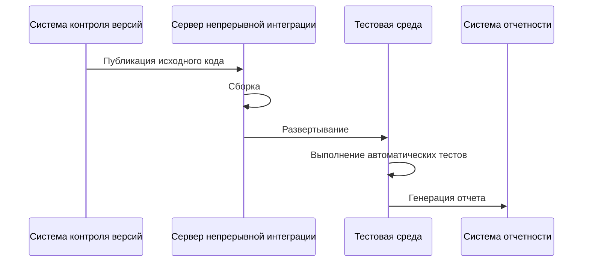

# Конвейеры CI/CD

- [Конвейеры CI/CD](#конвейеры-cicd)
  - [Непрерывная интеграция](#непрерывная-интеграция)
  - [Непрерывная доставка и развертывание](#непрерывная-доставка-и-развертывание)
  - [Процессы CI/CD](#процессы-cicd)
    - [Ключевые DevOps практики в CI/CD](#ключевые-devops-практики-в-cicd)
  - [Инструменты и технологии](#инструменты-и-технологии)
    - [GitHub Actions](#github-actions)
    - [GitLab CI](#gitlab-ci)
    - [Jenkins](#jenkins)
    - [Сравнение инструментов CI/CD](#сравнение-инструментов-cicd)
  - [Библиография](#библиография)

Современная разработка программных продуктов напоминает конвейерное производство. Каждая стадия создания ПО требует автоматизации и интеграции в единый процесс. Для решения этих задач применяются специализированные технологии: _непрерывная интеграция_ (Continuous Integration, CI) и _непрерывное развертывание_ (Continuous Delivery/Deployment, CD).

В процессе разработки ПО все создаваемые сущности называются _артефактами_ (artifacts). Это могут быть бинарные файлы, библиотеки, контейнеры, скрипты и другие компоненты, необходимые для работы приложения. Артефакты создаются на этапе сборки и используются на последующих этапах конвейера CI/CD.

## Непрерывная интеграция

Как уже было сказано в [главе про контроль версий](04_git.md), типичный рабочий процесс разработчика включает в себя следующие шаги:

1. **Планирование**: Определение задачи и создание feature-ветки;
2. **Разработка**: Реализация функциональности с регулярными коммитами;
3. **Предварительное тестирование**: Локальная проверка функциональности;
4. **Публикация**: Отправка ветки в удалённый репозиторий;
5. **Запрос на слияние (Pull Request)**: Создание запроса на слияние с описанием изменений;
6. **Автоматические проверки**: CI/CD конвейер, статический анализ;
7. **Мануальное ревью**: Проверка кода, архитектуры, обсуждение;
8. **Итерации**: Исправление замечаний и повторное ревью;
9. **Одобрение и слияние**: Интеграция в основную ветку.

Кроме этого, могут быть дополнительные шаги, такие как:

- **Интеграционное тестирование**: Проверка взаимодействия между компонентами;
- **Развёртывание в тестовой среде**: для автоматического и/или ручного тестирования;
- **Нагрузочное тестирование**: Проверка производительности под нагрузкой;
- **Развёртывание в производственной среде**: Собственно, запуск приложения в реальных условиях.

Обычно над проектом работают независимо сразу несколько разработчиков, каждый из которых может по нескольку раз в день вносить изменения в код. Чтобы избежать конфликтов и ошибок при интеграции изменений, используется практика непрерывной интеграции. Эта практика предполагает при каждом изменении кода автоматически запускать сборку и тестирование программного обеспечения.

**Непрерывная интеграция** (_Continuous Integration_, CI) — это практика разработки программного обеспечения, при которой изменения кода разработчиков интегрируются в общую кодовую базу несколько раз в день. Каждая интеграция проверяется автоматизированными сборками и тестами, что позволяет выявлять и исправлять ошибки быстрее.

При непрерывной интеграции на выделенном сервере запускается специализированная служба, которая по событию выполняет следующие шаги:

1. Получение исходного кода из системы контроля версий;
2. Сборка программного обеспечения;
3. Развертывание программного обеспечения в тестовой среде;
4. Запуск автоматических тестов;
5. Отправка отчета о результатах тестирования разработчикам.



Могут также существовать сборки по расписанию (_daily build_ или _nightly build_). Это позволяет уменьшить нагрузку на сервер непрерывной интеграции, а также позволяет разработчикам получать регулярные сборки для тестирования.

У непрерывной интеграции выделяют следующие преимущества:

- быстрое выявление и исправление ошибок;
- немедленный и регулярный прогон тестов;
- постоянное наличие текущей стабильной версии программного обеспечения;
- немедленный эффект от неполного кода приучает разработчиков к работе в итеративном режиме.

Недостатки непрерывной интеграции:

- дополнительные затраты на инфраструктуру и поддержку;
- необходимость в выделенных вычислительных ресурсах;
- требования к квалификации команды разработки.

## Непрерывная доставка и развертывание

**Непрерывная доставка** (_Continuous Delivery_, CD) — это практика разработки ПО, при которой каждое изменение кода проходит автоматизированную проверку качества и безопасности, становясь готовым к выпуску в продуктивную среду. Это позволяет разработчикам быстрее и надежнее доставлять изменения пользователям.

Кроме непрерывной доставки также может быть организовано **непрерывное развертывание** (Continuous Deployment), при котором каждое изменение кода автоматически разворачивается в продукцию без участия разработчиков. Это позволяет сократить время между написанием кода и его выпуском, а также упростить процесс релиза. Однако, непрерывное развертывание требует более тщательного контроля качества и безопасности кода, чтобы избежать ошибок в продуктивной среде.

Разница между непрерывной доставкой и непрерывным развертыванием заключается в том, что в первом случае разработчики решают, когда выпустить изменения в продукцию, а во втором случае это происходит автоматически.

Внедрение процессов CI/CD предъявляет дополнительные требования к инфраструктуре и методологии разработки.

## Процессы CI/CD

Процесс CI/CD обычно организуется в виде конвейера (pipeline), состоящего из нескольких этапов (stages). Каждый этап выполняет определенную задачу, такую как сборка, тестирование, развертывание и т.д. Этапы могут выполняться последовательно или параллельно, в зависимости от требований проекта.

Стандартный процесс CI/CD может включать следующие этапы:

1. **Сборка**: Компиляция исходного кода и создание артефактов (например, бинарных файлов, контейнеров и т.д.);
2. **Тестирование**: Запуск автоматических тестов для проверки функциональности, производительности и безопасности;
3. **Сканирование безопасности**: Анализ уязвимостей, проверка зависимостей и соответствие требованиям безопасности;
4. **Анализ качества кода**: Использование статического анализа для проверки соответствения стандартам качества и безопасности;
5. **Развертывание в тестовой среде**: Автоматическое развертывание артефактов в тестовой среде для дальнейшего тестирования;
6. **Ручное тестирование**: Проведение мануального тестирования и приемочного тестирования;
7. **Развертывание в продуктивной среде**: Автоматическое или ручное развертывание артефактов в продуктивной среде.

Дополнительным этапом может быть **мониторинг** (monitoring), который включает в себя сбор и анализ метрик производительности, логов и других данных для обеспечения стабильной работы приложения в продуктивной среде.

### Ключевые DevOps практики в CI/CD

Современные конвейеры CI/CD должны включать следующие DevOps практики:

**Инфраструктура как код (Infrastructure as Code, IaC):**

- Провизионирование окружений через код (Terraform, CloudFormation)
- Контроль версий для конфигураций инфраструктуры
- Консистентность настройки окружений на всех этапах

**Управление конфигурацией:**

- Вынесение конфигурации во внешние файлы (переменные окружения, конфиг-файлы)
- Управление секретами (HashiCorp Vault, облачные менеджеры секретов)
- Конфигурации, специфичные для каждого окружения

**Контейнерная стратегия:**

- Контейнеризация с Docker для обеспечения консистентности
- Управление реестром контейнеров
- Оркестрация Kubernetes для продуктивных развертываний

**Шлюзы качества:**

- Автоматизированные пороги качества (покрытие тестами, сканирование безопасности)
- Остановка конвейера при нарушении шлюзов качества
- Процессы ручного утверждения для продуктивных развертываний

Каждый этап конвейера включает три фазы:

1. **Подготовка**: настройка окружения, зависимостей и параметров
2. **Выполнение**: реализация основной логики этапа
3. **Обработка результатов**: логирование, уведомления, сохранение артефактов

Для каждого этапа можно определить условия запуска: выполнение только при успехе предыдущего этапа, запуск по расписанию или при выполнении определенных критериев.

Процессы CI/CD обычно организуются с помощью специализированных инструментов, таких как Jenkins, GitLab CI/CD, GitHub Actions, CircleCI и другие. Эти инструменты позволяют автоматизировать сборку, тестирование и развертывание программного обеспечения. Они также предоставляют возможности для мониторинга и управления процессами CI/CD, а также интеграции с другими инструментами разработки.

## Инструменты и технологии

### GitHub Actions

GitHub Actions — это встроенный инструмент CI/CD для GitHub, который позволяет автоматизировать рабочие процессы прямо в репозитории. Он позволяет создавать конвейеры для сборки, тестирования и развертывания приложений, используя YAML-файлы для описания этапов и условий их выполнения.

Для создания конвейера в GitHub Actions используется файл `.github/workflows/<workflow-name>.yml`, в котором описываются три основных компонента:

- **События (events)**: Определяют, когда должен запускаться конвейер (например, при выталкивании кода (Push) в ветку, создании запроса на слияние (Pull Request) и т.д.);
- **Задания (jobs)**: Определяют набор задач, которые должны быть выполнены в рамках конвейера. Каждое задание может состоять из нескольких шагов;
- **Шаги (steps)**: Определяют конкретные действия, которые должны быть выполнены в рамках задания (например, установка зависимостей, запуск тестов, развертывание и т.д.).

Пример простого конвейера, который запускается при каждом создании запроса на слияние в ветку `main`, выполняет настройку окружения для Node.js, устанавливает зависимости, запускает линтинг, тесты с покрытием, проверку безопасности и собирает приложение:

```yaml
name: CI/CD Pipeline
on:
  pull_request:
    branches: [main]

env:
  NODE_VERSION: '21'

jobs:
  test:
    runs-on: ubuntu-latest
    steps:
      - name: Checkout code
        uses: actions/checkout@v4
        
      - name: Setup Node.js
        uses: actions/setup-node@v4
        with:
          node-version: ${{ env.NODE_VERSION }}
          cache: 'npm'
          
      - name: Install dependencies
        run: npm ci
        
      - name: Run linting
        run: npm run lint
        
      - name: Run tests with coverage
        run: npm run test:coverage
        
      - name: Security audit
        run: npm audit --audit-level=high
        
      - name: Build application
        run: npm run build
```

### GitLab CI

GitLab CI — это инструмент CI/CD, встроенный в GitLab, который позволяет автоматизировать процессы сборки, тестирования и развертывания приложений. Он использует файл `.gitlab-ci.yml` для определения этапов и условий выполнения.

Пример простого конвейера в GitLab CI, который запускается при каждом создании запроса на слияние в ветку `main`, выполняет настройку окружения для Node.js, устанавливает зависимости, запускает линтинг, тесты с покрытием, проверку безопасности и собирает приложение:

```yaml
stages:
  - test
  - security
  - build

variables:
  NODE_VERSION: "21"

before_script:
  - node --version
  - npm --version

test_job:
  stage: test
  image: node:21
  rules:
    - if: $CI_PIPELINE_SOURCE == "merge_request_event"
  script:
    - npm ci
    - npm run lint
    - npm run test:coverage
  coverage: '/Lines\s*:\s*(\d+\.?\d*)%/'
  artifacts:
    reports:
      coverage_report:
        coverage_format: cobertura
        path: coverage/cobertura-coverage.xml
  cache:
    paths:
      - node_modules/

security_scan:
  stage: security
  image: node:21
  rules:
    - if: $CI_PIPELINE_SOURCE == "merge_request_event"
  script:
    - npm audit --audit-level=high
  allow_failure: false

build_job:
  stage: build
  image: node:21
  rules:
    - if: $CI_PIPELINE_SOURCE == "merge_request_event"
  script:
    - npm ci
    - npm run build
  cache:
    paths:
      - node_modules/
```

### Jenkins

Jenkins — это популярная платформа автоматизации CI/CD с открытым исходным кодом. Возможность установки на собственный сервер, большая экосистема плагинов и гибкость настройки делают его одним из самых распространённых инструментов для организации процессов непрерывной интеграции и доставки.

Конвейеры в Jenkins определяются через файл `Jenkinsfile`, содержащий описание этапов, условий выполнения и логики сборки. `Jenkinsfile` пишется на языке Groovy, который является динамическим языком программирования, основанным на Java. Язык Groovy был разработан для упрощения написания сценариев, как дополнение к Java.

Пример простого `Jenkinsfile`, который выполняет установку зависимостей, линтинг, тестирование с покрытием, проверку безопасности и сборку приложения:

```groovy
pipeline {
    agent any
    
    tools {
        nodejs '21'
    }
    
    stages {
        stage('Install Dependencies') {
            steps {
                echo 'Installing dependencies...'
                sh 'npm ci'
            }
        }
        
        stage('Lint') {
            steps {
                echo 'Running linting...'
                sh 'npm run lint'
            }
        }
        
        stage('Test') {
            steps {
                echo 'Running tests with coverage...'
                sh 'npm run test:coverage'
            }
        }
        
        stage('Security Audit') {
            steps {
                echo 'Running security audit...'
                sh 'npm audit --audit-level=high'
            }
        }
        
        stage('Build') {
            steps {
                echo 'Building application...'
                sh 'npm run build'
            }
        }
    }
    
    post {
        success {
            echo 'Pipeline completed successfully!'
        }
        failure {
            echo 'Pipeline failed.'
        }
    }
}
```

### Сравнение инструментов CI/CD

Ниже представлено сравнение трёх популярных инструментов CI/CD: Jenkins, GitHub Actions и GitLab CI/CD.

| Функция              | Jenkins                                      | GitHub Actions           | GitLab CI/CD                                     |
| -------------------- | -------------------------------------------- | ------------------------ | ------------------------------------------------ |
| Простота настройки   | Средняя до сложной (самостоятельный хостинг) | Легкая (облачный сервис) | Легкая (облачный сервис)                         |
| Настраиваемость      | Обширная                                     | Средняя                  | Высокая                                          |
| Интеграция           | На основе плагинов                           | Встроенная в GitHub      | Встроенная в GitLab                              |
| Функции безопасности | Зависит от плагинов                          | Базовая                  | Встроенные DevSecOps                             |
| Лучший хостинг       | Самостоятельный хостинг                      | Облачный сервис          | Гибридный (облачный или самостоятельный хостинг) |
| Кривая обучения      | Крутая                                       | Минимальная              | Средняя                                          |
| Поддержка сообщества | Большое, с открытым исходным кодом           | Растущая                 | Большое, интегрированное                         |

Для выбора подходящего инструмента CI/CD важно учитывать требования проекта, опыт команды и инфраструктурные возможности. Для сложных энтерпрайз-проектов с особыми требованиями к безопасности и кастомизации может подойти Jenkins. Для проектов, размещённых на GitHub, удобен GitHub Actions благодаря тесной интеграции. GitLab CI/CD отлично подходит для команд, использующих GitLab, благодаря богатому функционалу и встроенным DevSecOps возможностям.

## Библиография

1. [Pipeline as Code, Jenkins](https://www.jenkins.io/doc/book/pipeline/pipeline-as-code)
2. [edeshina, Jenkins Scripted Pipeline: как использовать, Habr, 2023-01-10](https://habr.com/ru/companies/slurm/articles/709804)
3. [Vovanikys, От кода «на коленке» к эффективному CI/CD: строим общий Pipeline as Code командой в 100+ человек, Habr, 2022-11-02](https://habr.com/ru/companies/lemana_tech/articles/695604)
4. [Pipeline as Code with Jenkins, Jenkins](https://www.jenkins.io/solutions/pipeline)
5. [GitHub Actions Documentation](https://docs.github.com/en/actions)
6. [GitLab CI/CD Documentation](https://docs.gitlab.com/ee/ci/)
7. [Pittet Sten, Continuous Integration vs Continuous Delivery vs Continuous Deployment, Atlassian](https://www.atlassian.com/continuous-delivery/principles/continuous-integration-vs-delivery-vs-deployment)
8. [Vivesh, Jenkins vs. GitHub Actions vs. GitLab CI, Dev.to, 2024](https://dev.to/574n13y/jenkins-vs-github-actions-vs-gitlab-ci-2k35)
